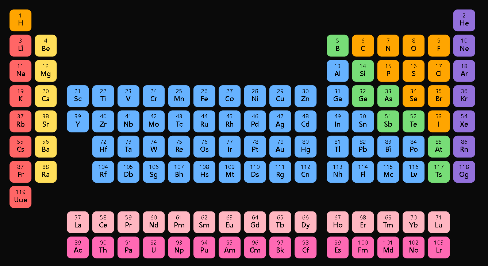
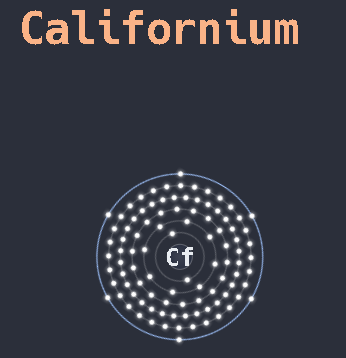

# obsidian-periodic-table
An obsidian plugin that adds a simplistic, color-coded, and interactive periodic table to your notes that links to custom made notes about the respective elements. It can also render simplistic svgs of atoms using json and javascript.

## Installation
1. Install main.js, manifest.json, elements.7z (recommended, but optional), periodic_table.css and [periodic-table-lookup.json](https://github.com/Bowserinator/Periodic-Table-JSON/blob/master/periodic-table-lookup.json) 
2. Create folder under .obsidian/plugins call it "periodic-table-widget" (or whatever).
3. Move main.js and manifest.json into newly made folder.
4. Extract elements.7z into vault (if optional step taken, links all cells of periodic table to files)
5. Move elements_cards.css into .obsidian/snippets
6. Take [periodic-table-lookup.json](https://github.com/Bowserinator/Periodic-Table-JSON/blob/master/periodic-table-lookup.json) provided by Browserinator (thanks a lot!) and drop it into root folder of vault (everywhere else and it won't work).
7. Open Obsidian and load plugin as usual.

### Folder Structure
```text
Vault/
├── periodic-table-lookup.json
├── elements/
├── .obsidian/
│   ├── plugins/
│   │   └── periodic-table-widget/
│   │       ├── main.js
│   │       └── manifest.json
│   └── snippets/
│       └── periodic_table.css
```
## Documentation and Use Cases
To see the table, open any note and insert it using a [code block](https://help.obsidian.md/syntax#Code+blocks) and the keyword `periodic-table`.
The periodic table should now be visible as an interactive svg.

<p align="center">
  
</p>

When clicking on an element you will be linked to the respective note, given you have extracted or created them (notes are collectively provided in elements.7z).

You can render atoms using a [code block](https://help.obsidian.md/syntax#Code+blocks) and the keyword `bohr`, inside the codeblock.
You then need to write either the atom number, the name of the atom (less "international"), or the atom symbol inside the code block.
You should now see an animated atom of the corresponding element.
<p align="center">
  
</p>

In addition, if necessary, although it's already done on each and every file inside elements.7z, you can render all information of a specific element.
Use a [code block](https://help.obsidian.md/syntax#Code+blocks) and the keyword `element-card` inside the codeblock.
Similar to the `bohr` codeblock, you need to then write either the atom number, the name of the atom (less "international"), or the atom symbol inside the code block. You should now see a card displayed with all relevant information fetched from the periodic-table-lookup.json

## Modifications and Possibilities
All colors and animations can be easily modified in the main.js and elements_cards.css file using basic js and css.
